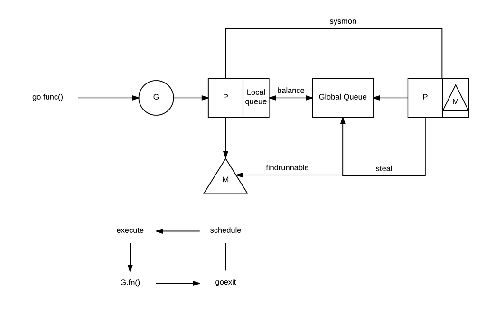

##什么是goroutine？
Goroutines是一系列并发执行的函数，它们之间共享相同的地址空间。

###与Thread的区别
* 它们的调度由go runtime完成，不需要内核的参与，一切都在用户态进行，内核甚至不知有goroutine的存在。
* goroutine比thread轻量，它的栈大小只有2K，(我的linux上默认stack size是8K，可以通过ulimit -a查看)

##goroutine的调度
###基本概念
goroutine的调度是由go runtime管理的，调度模型又叫做：P-M-G模型。以下内容均在runtime/runtime2.go中的定义：

G即goroutine，由g结构体表示。它包含当前M(Machine)、goroutine的栈、pc(Program Counter)、goroutine id等信息，存在于P的local队列里，或全局队列里(较少使用)。


type g struct {
    stack       stack   // stack of goroutine
    m           *m      // current m; offset known to arm liblink
    sched       gobuf
    goid        int64   // goroutine id
    gopc        uintptr // pc of go statement that created this goroutine
    startpc     uintptr // pc of goroutine function
    ...
}

type gobuf struct {
    sp   uintptr
    pc   uintptr
    g    guintptr
    ...
}


M即Machine，代表一个线程，由runtime/runtime2.go中的m结构体表示，包含thread当前的状态、当前逻辑Processor、当前运行的goroutine等信息：


type m struct {
    g0            *g            // goroutine with scheduling stack
    tls           [6]uintptr    // thread-local storage (for x86 extern register)
    curg          *g            // current running goroutine
    p             puintptr      // attached p for executing go code (nil if not executing go code)
    nextp         puintptr
    id            int64
    spinning      bool          // m is out of work and is actively looking for work
    blocked       bool          // m is blocked on a note
    thread        uintptr       // thread handle
    ...
}


P即Processor，代表一个逻辑处理器，由p结构体表示，包含id、状态、goroutine队列、当前绑定的M等信息。P的数量可以通过runtime.GOMAXPROCS来设置：


type p struct {
    lock mutex

    id          int32
    status      uint32 // one of pidle/prunning/...
    schedtick   uint32     // incremented on every scheduler call
    syscalltick uint32     // incremented on every system call
    sysmontick  sysmontick // last tick observed by sysmon
    m           muintptr   // back-link to associated m (nil if idle)
    deferpool    [5][]*_defer // pool of available defer structs of different sizes (see panic.go)

    // Cache of goroutine ids, amortizes accesses to runtime·sched.goidgen.
    goidcache    uint64

    // Queue of runnable goroutines. Accessed without lock.
    runqhead uint32
    runqtail uint32
    runq     [256]guintptr

    // Available G's (status == Gdead)
    gfree    *g
    gfreecnt int32
    ...
}


此外还有一个重要的结构体schedt，可以将其粗略理解为scheduler本身：


type schedt struct {
	lock mutex
        midle        muintptr // idle m's waiting for work
        nmidle       int32    // number of idle m's waiting for work
        nmidlelocked int32    // number of locked m's waiting for work
        mnext        int64    // number of m's that have been created and next M ID
        maxmcount    int32    // maximum number of m's allowed (or die)
        nmsys        int32    // number of system m's not counted for deadlock
        nmfreed      int64    // cumulative number of freed m's

        pidle      puintptr   // idle p's
        npidle     uint32     // number of idle p's

        // Global runnable queue.
        runqhead guintptr
        runqtail guintptr
        runqsize int32

        // Global cache of dead G's.
        gflock       mutex
        gfreeStack   *g
        gfreeNoStack *g
        ngfree       int32

        // Central pool of available defer structs of different sizes.
        deferlock mutex
        deferpool [5]*_defer
        // freem is the list of m's waiting to be freed when their
        // m.exited is set. Linked through m.freelink.
        freem *m

        gcwaiting  uint32 // gc is waiting to run
        stopwait   int32
        stopnote   note
        sysmonwait uint32
        sysmonnote note

}


###调度流程
goroutine的调度流程如下图：

1. G被创建后，被放入P的本地队列或schedt中的全局队列。
2. M被创建或唤醒后，与P绑定，进入schedule循环。

####work-stealing
若M所绑定的P的本地队列已空，将从另一个随机的P中的本地队列中偷取一半的G。

####系统调用
当G调用syscall时，不仅G会阻塞，执行该G的M也会阻塞(因为M其实是线程)。这时，P会与M解绑，若此时有idle状态的M，则P会与新的M绑定，并继续执行P本地队列中的其他G；若没有idle的M，那就创建新的M。

####channel阻塞或network I/O情况下的调度
若G阻塞在channel操作或network I/O操作上时，G会被放置到某个wait队列中，而M会尝试运行下一个runnable的G。若没有runnable的G，M会与P解绑，并进入sleep状态。当I/O available或channel操作完成，在wait队列中的G会被唤醒，标记为runnable，放入到某P的队列中，绑定一个M继续执行。

####抢占式调度
为了避免G运行时间过长，导致其他G得不到调度，go支持抢占式调度。当G运行一段时间后，会被标记为可以抢占的，当G下一次调用函数时，就会被抢占，调度器会选取另一个G运行。

原理是，在每个函数的入口加一段额外代码，使runtime有机会检查是否需要执行抢占式调度。这种解决方案只能说局部解决了“饿死”问题，对于没有函数调用，纯算法循环计算的G，scheduler依然无法抢占。

###特殊栈：g0
每个M都有一个特殊的栈：g0。g0只是用来存放M的call stack等信息。当要执行Go runtime的一些逻辑比如创建G、新建M等，都会首先切换到g0栈然后执行；而执行g任务时，会切换到g的栈上。

###特殊goroutine：sysmon
sysmon是一个监控用的goroutine，不需要P就可以运行。它有3个作用：
1. 将长时间没有处理的netpoll的G添加全局队列
2. 处理长时间处于Psyscall状态的P
3. 设置过长时间运行的G的抢占标志位。

##相关链接
* Go调度详解：https://zhuanlan.zhihu.com/p/27056944
* Dive into goroutine in Go：http://hustcat.github.io/dive-into-goroutine/
